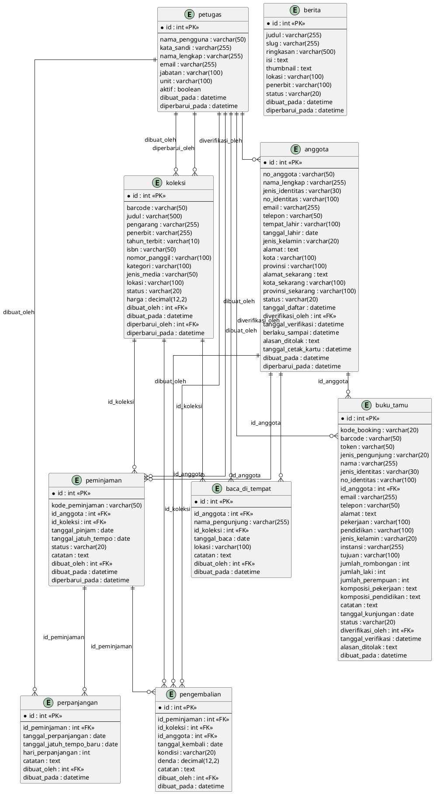

# Skema Database Perpustakaan (Versi 2) - PlantUML

```plantuml
@startuml
skinparam linetype ortho

entity petugas {
  * id : int <<PK>>
  --
  nama_pengguna : varchar(50)
  kata_sandi : varchar(255)
  nama_lengkap : varchar(255)
  email : varchar(255)
  jabatan : varchar(100)
  unit : varchar(100)
  aktif : boolean
  dibuat_pada : datetime
  diperbarui_pada : datetime
}

entity anggota {
  * id : int <<PK>>
  --
  no_anggota : varchar(50)
  nama_lengkap : varchar(255)
  jenis_identitas : varchar(30)
  no_identitas : varchar(100)
  email : varchar(255)
  telepon : varchar(50)
  tempat_lahir : varchar(100)
  tanggal_lahir : date
  jenis_kelamin : varchar(20)
  alamat : text
  kota : varchar(100)
  provinsi : varchar(100)
  alamat_sekarang : text
  kota_sekarang : varchar(100)
  provinsi_sekarang : varchar(100)
  status : varchar(20)
  tanggal_daftar : datetime
  diverifikasi_oleh : int <<FK>>
  tanggal_verifikasi : datetime
  berlaku_sampai : datetime
  alasan_ditolak : text
  tanggal_cetak_kartu : datetime
  dibuat_pada : datetime
  diperbarui_pada : datetime
}

entity koleksi {
  * id : int <<PK>>
  --
  barcode : varchar(50)
  judul : varchar(500)
  pengarang : varchar(255)
  penerbit : varchar(255)
  tahun_terbit : varchar(10)
  isbn : varchar(50)
  nomor_panggil : varchar(100)
  kategori : varchar(100)
  jenis_media : varchar(50)
  lokasi : varchar(100)
  status : varchar(20)
  harga : decimal(12,2)
  dibuat_oleh : int <<FK>>
  dibuat_pada : datetime
  diperbarui_oleh : int <<FK>>
  diperbarui_pada : datetime
}

entity peminjaman {
  * id : int <<PK>>
  --
  kode_peminjaman : varchar(50)
  id_anggota : int <<FK>>
  id_koleksi : int <<FK>>
  tanggal_pinjam : date
  tanggal_jatuh_tempo : date
  status : varchar(20)
  catatan : text
  dibuat_oleh : int <<FK>>
  dibuat_pada : datetime
  diperbarui_pada : datetime
}

entity perpanjangan {
  * id : int <<PK>>
  --
  id_peminjaman : int <<FK>>
  tanggal_perpanjangan : date
  tanggal_jatuh_tempo_baru : date
  hari_perpanjangan : int
  catatan : text
  dibuat_oleh : int <<FK>>
  dibuat_pada : datetime
}

entity pengembalian {
  * id : int <<PK>>
  --
  id_peminjaman : int <<FK>>
  id_koleksi : int <<FK>>
  id_anggota : int <<FK>>
  tanggal_kembali : date
  kondisi : varchar(20)
  denda : decimal(12,2)
  catatan : text
  dibuat_oleh : int <<FK>>
  dibuat_pada : datetime
}

entity baca_di_tempat {
  * id : int <<PK>>
  --
  id_anggota : int <<FK>>
  nama_pengunjung : varchar(255)
  id_koleksi : int <<FK>>
  tanggal_baca : date
  lokasi : varchar(100)
  catatan : text
  dibuat_oleh : int <<FK>>
  dibuat_pada : datetime
}

entity buku_tamu {
  * id : int <<PK>>
  --
  kode_booking : varchar(20)
  barcode : varchar(50)
  token : varchar(50)
  jenis_pengunjung : varchar(20)
  nama : varchar(255)
  jenis_identitas : varchar(30)
  no_identitas : varchar(100)
  id_anggota : int <<FK>>
  email : varchar(255)
  telepon : varchar(50)
  alamat : text
  pekerjaan : varchar(100)
  pendidikan : varchar(100)
  jenis_kelamin : varchar(20)
  instansi : varchar(255)
  tujuan : varchar(100)
  jumlah_rombongan : int
  jumlah_laki : int
  jumlah_perempuan : int
  komposisi_pekerjaan : text
  komposisi_pendidikan : text
  catatan : text
  tanggal_kunjungan : date
  status : varchar(20)
  diverifikasi_oleh : int <<FK>>
  tanggal_verifikasi : datetime
  alasan_ditolak : text
  dibuat_pada : datetime
}

entity berita {
  * id : int <<PK>>
  --
  judul : varchar(255)
  slug : varchar(255)
  ringkasan : varchar(500)
  isi : text
  thumbnail : text
  lokasi : varchar(100)
  penerbit : varchar(100)
  status : varchar(20)
  dibuat_pada : datetime
  diperbarui_pada : datetime
}

petugas ||--o{ anggota : "diverifikasi_oleh"
petugas ||--o{ koleksi : "dibuat_oleh"
petugas ||--o{ koleksi : "diperbarui_oleh"
petugas ||--o{ peminjaman : "dibuat_oleh"
petugas ||--o{ perpanjangan : "dibuat_oleh"
petugas ||--o{ pengembalian : "dibuat_oleh"
petugas ||--o{ baca_di_tempat : "dibuat_oleh"
petugas ||--o{ buku_tamu : "diverifikasi_oleh"

anggota ||--o{ peminjaman : "id_anggota"
anggota ||--o{ pengembalian : "id_anggota"
anggota ||--o{ baca_di_tempat : "id_anggota"
anggota ||--o{ buku_tamu : "id_anggota"

koleksi ||--o{ peminjaman : "id_koleksi"
koleksi ||--o{ pengembalian : "id_koleksi"
koleksi ||--o{ baca_di_tempat : "id_koleksi"

peminjaman ||--o{ perpanjangan : "id_peminjaman"
peminjaman ||--o{ pengembalian : "id_peminjaman"

@enduml
```
